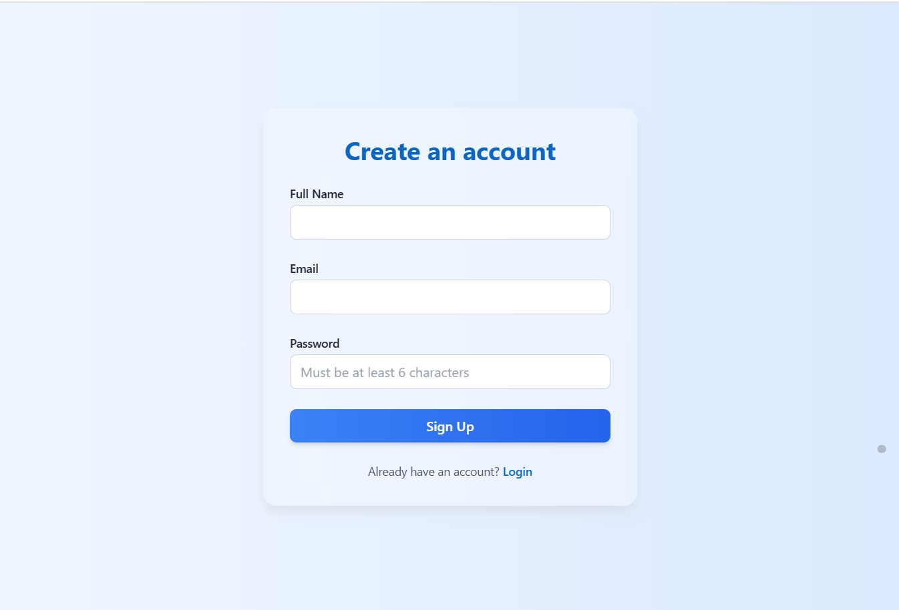
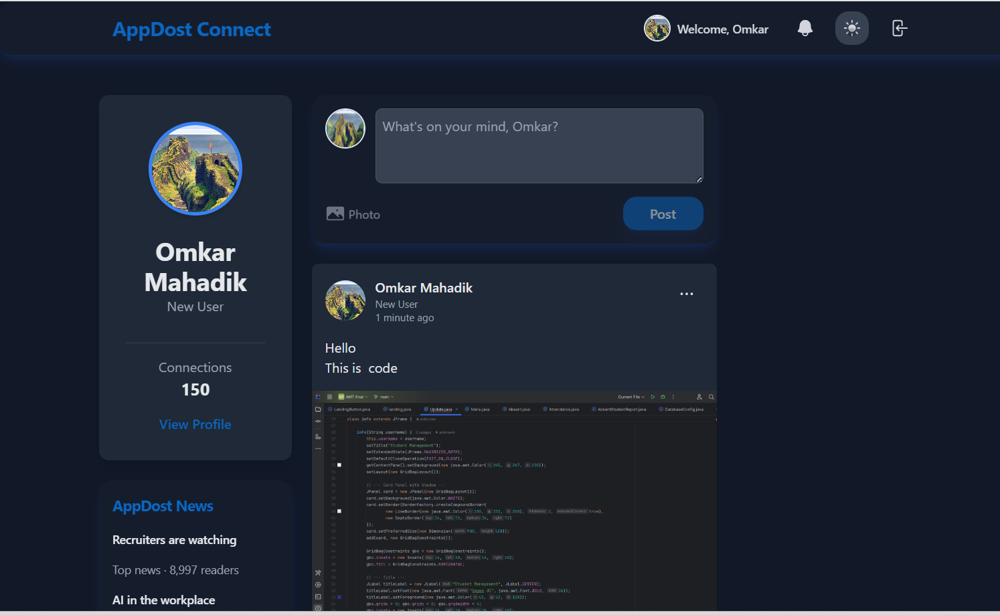

# 🌐 AppDost Connect

**A Full-Stack MERN Social Media Platform**  
Built as a technical submission for the **AppDost Full Stack Developer Internship**.

AppDost Connect is a **modern, responsive, and feature-rich** social platform inspired by **LinkedIn**, designed to showcase strong **frontend + backend integration**, **clean architecture**, and **advanced MERN development skills**.

---

## 👨‍💻 Submitted By

**Name:** Omkar Mahadik  
**Email:** [omkarmahadik180@gmail.com](mailto:omkarmahadik180@gmail.com)  
**LinkedIn:** [linkedin.com/in/omkar-mahadik-976532283](https://www.linkedin.com/in/omkar-mahadik-976532283/)  

---

## 🚀 Live Demo Links

- **Frontend (Vercel):** [https://fullstack-submission-appdost.vercel.app](https://fullstack-submission-appdost.vercel.app)  
- **Backend (Render):** [https://fullstack-submission-appdost.onrender.com](https://fullstack-submission-appdost.onrender.com)  

---

## 📸 Project Demo

🎥 _Add your demo GIF or screenshots here_  






> Shows main feed, dark mode, post interactions, and profile editing.

---

## ✨ Features Overview

This project includes **all core assignment requirements**, **optional bonus features**, and several **advanced “wow” enhancements** to demonstrate full-stack mastery.

---

### ✅ Core Requirements

- 🔐 **User Authentication** — Secure signup, login, and logout using **JWT + cookies**  
- 📝 **Create Posts** — Authenticated users can create posts with text  
- 📰 **Public Feed** — View a global feed with latest posts first  
- 👤 **User Identity** — Logged-in user's name displayed in navbar  

---

### 🌟 Bonus & “Wow” Features

#### 🧠 UI/UX Enhancements
- 🎨 Clean, minimal, and fully **responsive** design  
- 🌙 Full **Dark Mode** support  

#### 📸 Posts
- 📷 Image upload support (stored on **Cloudinary**)  
- ✏️ **Edit** and 🗑️ **Delete** your posts  
- ❤️ Like & Unlike functionality  

#### 💬 Advanced Comment System
- 💭 Add, edit, and delete comments  
- 👍 Like/Unlike comments  
- 💡 **Comment Suggestions**: Quick-reply buttons (e.g., “Congratulations!”)

#### 👥 Profile Management
- 🧍 View your own or others’ profiles  
- 🪞 **Edit profile** (Full Name, Headline, Bio/Description)  
- 🖼️ Upload or remove **profile picture**  
- 🔙 “Back” navigation from profile  

#### 🔔 Notification System
- 🛎️ Notifications for likes, comments, and replies  
- 🔴 Unread dot indicator on navbar bell icon  
- ✅ Auto-mark as “read” when dropdown is viewed  

---

## 🧰 Tech Stack

| Layer | Technology |
|-------|-------------|
| **Frontend** | React.js (Vite), Tailwind CSS, React Router, Framer Motion, React Hot Toast |
| **Backend** | Node.js, Express.js, MongoDB (Atlas), JWT, Cloudinary |
| **Database** | MongoDB Atlas |
| **Hosting** | Frontend → Vercel, Backend → Render |
| **Image Storage** | Cloudinary |

---

## ⚙️ Getting Started (Run Locally)

Follow these steps to set up the project locally 👇

---

### 🪄 Prerequisites

Make sure you have:
- **Node.js** (v18+)
- **npm**
- **MongoDB Atlas** account
- **Cloudinary** account (for image uploads)

---

### 1️⃣ Clone the Repository

```bash
git clone https://github.com/OmkarM9090/fullstack-submission-appdost.git
cd fullstack-submission-appdost

### 2️⃣ Backend Setup
# Navigate to backend
cd backend

# Install dependencies
npm install

# Create environment file
cp .env.example .env

Now open .env and add your credentials:

MONGO_URI=your_mongo_connection_string
JWT_SECRET=your_secret_key
CLOUDINARY_CLOUD_NAME=your_cloud_name
CLOUDINARY_API_KEY=your_api_key
CLOUDINARY_API_SECRET=your_api_secret

Run the backend server:

npm run dev


Server will start on http://localhost:5001

3️⃣ Frontend Setup
# Navigate to frontend
cd ../frontend/my-app

# Install dependencies
npm install

# Create environment file
cp .env.example .env


Add backend API URL:

VITE_API_URL=http://localhost:5001


Run the development server:

npm run dev
App will be running at http://localhost:5173

📁 Folder Structure
fullstack-submission-appdost/
│
├── backend/              # Express + MongoDB backend
│   ├── controllers/
│   ├── models/
│   ├── routes/
│   ├── middlewares/
│   ├── utils/
│   └── server.js
│
├── frontend/
│   └── my-app/           # React (Vite) frontend
│       ├── src/
│       │   ├── components/
│       │   ├── pages/
│       │   ├── hooks/
│       │   ├── store/
│       │   └── utils/
│       └── public/
│
└── README.md
🔒 Environment Variables

Both frontend and backend use environment variables for security and configuration.

Backend .env.example
PORT=5001
MONGO_URI=
JWT_SECRET=
CLOUDINARY_CLOUD_NAME=
CLOUDINARY_API_KEY=
CLOUDINARY_API_SECRET=

Frontend .env.example
VITE_API_URL=http://localhost:5001


📬 API Endpoints Overview
| Endpoint            | Method | Description       |
| ------------------- | ------ | ----------------- |
| `/auth/signup`      | POST   | Register new user |
| `/auth/login`       | POST   | Login user        |
| `/auth/logout`      | GET    | Logout user       |
| `/posts`            | GET    | Get all posts     |
| `/posts`            | POST   | Create post       |
| `/posts/:id`        | PUT    | Edit post         |
| `/posts/:id`        | DELETE | Delete post       |
| `/comments/:postId` | POST   | Add comment       |
| `/profile/:id`      | GET    | View user profile |
| `/notifications`    | GET    | Get notifications |
🧠 Key Learnings

Efficient frontend-backend integration

Handling JWT authentication & secure cookies

Image upload & hosting via Cloudinary

Building reusable React components

Managing state using custom hooks & stores

Implementing clean, scalable folder structure

💫 Future Enhancements

💬 Real-time chat & messaging

🔔 Push notifications

🧑‍🤝‍🧑 Follow system (connections)

📊 Analytics dashboard

🕵️‍♂️ Explore feed with AI suggestions

🏁 Conclusion

AppDost Connect demonstrates strong full-stack MERN expertise, clean UI/UX design, and the ability to build real-world, scalable web applications.

If you liked this project, please ⭐ the repo and connect with me on LinkedIn!

🧾 License

This project is for educational and internship evaluation purposes under the AppDost Internship Assignment guidelines.

© 2025 Omkar Mahadik | AppDost Connect
